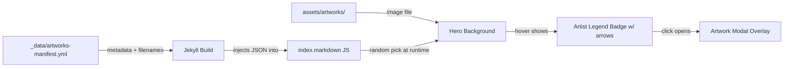

# Hero Section Artwork Rotation Feature

## Overview

Replace the hero section gradient background with a randomly-selected artwork image on each page load. On hover, a small legend appears in the lower-left corner showing the artist name as a clickable link. Clicking it opens a full-page modal overlay presenting the artwork at full resolution along with metadata (artist, title, date, source link, description).

---

## Architecture Diagram



---

## File Structure

### New Directories & Files

```
tegneklubben-site/
├── _data/
│   └── artworks-manifest.yml          ← NEW: single source of truth for all artworks
├── assets/
│   └── artworks/                       ← NEW: flat folder for artwork images only
│       ├── artwork-01.jpg              ← image file
│       ├── artwork-02.png              ← image file
│       └── artwork-03.jpg              ← image file (metadata in manifest)
├── _layouts/
│   └── home.html                       ← MODIFY: add modal overlay + JS
├── index.markdown                      ← MODIFY: inject artwork list into data attribute
└── assets/css/style.scss               ← MODIFY: add hero bg-image, legend badge, modal styles
```

---

## 1. Manifest File (`_data/artworks-manifest.yml`) — Single Source of Truth

Since Jekyll cannot dynamically glob files from `assets/`, we maintain a manifest that holds both the image filename and all metadata inline:

```yaml
# _data/artworks-manifest.yml
artworks:
  - filename: "artwork-01.jpg"
    artist: "Anna Larsson"
    artist_link: "https://example.com"
    title: "Morning in Copenhagen"
    date: "2026"
    source_link: "https://example.com/morning-copenhagen"
    description: "A watercolor study of the harbor at dawn, done during the Tegneklubben meetup at Nørrebro."
  - filename: "artwork-02.png"
    # minimal entry — all fields use defaults below
  - filename: "artwork-03.jpg"
    artist: "Peter Kongsgaard"
    title: "Tegneaften ved Nørrebro Park"
    date: "2026-06"
```

**Optional fields** — any missing field falls back to defaults:

| Field | Default |
|-------|---------|
| `artist` | "Unknown" |
| `artist_link` | (none — link omitted) |
| `title` | "Untitled" |
| `date` | "Unknown" |
| `source_link` | (none) |
| `description` | "" (empty) |

---

## 3. Hero Section Changes (`index.markdown`)

The hero section HTML stays the same structure, but we add a hidden data container:

```html
<section class="hero" id="hero">
  <div class="hero-bg"></div>
  <div class="hero-overlay"></div>
  <div class="hero-content">
    <h1>Tegneklubben</h1>
    <p class="hero-tagline">Tegne- og malearrangementer — find fællesskab og inspiration.</p>
    <a href="{{ site.mailing_list.url }}" target="_blank" class="btn btn-primary">
      {{ site.mailing_list.button_text }}
    </a>
  </div>

  <!-- Artist legend badge (hidden until hover) -->
  <div class="hero-artist-badge" id="heroArtistBadge" style="display:none;">
    <button class="badge-nav badge-nav-prev" id="badgeNavPrev" title="Previous artwork">&#8249;</button>
    <div class="badge-info">
      <span class="artist-name" id="artistName"></span>
      <span class="artist-title" id="artistTitle"></span>
    </div>
    <button class="badge-nav badge-nav-next" id="badgeNavNext" title="Next artwork">&#8250;</button>
  </div>

  <!-- Artwork data (injected by JS from manifest) -->
  <div id="heroArtworksData" style="display:none;"
       data-artworks='[{"filename":"artwork-01.jpg","artist":"Anna Larsson","title":"Morning in Copenhagen"},{"filename":"artwork-02.png","artist":"Unknown","title":"Untitled"}]'>
  </div>
</section>

<!-- Artwork Modal Overlay -->
<div class="artwork-modal" id="artworkModal" style="display:none;">
  <div class="artwork-modal-backdrop"></div>
  <div class="artwork-modal-content">
    <button class="artwork-modal-close" id="artworkModalClose">&times;</button>
    <div class="artwork-modal-body">
      
      <div class="artwork-modal-info">
        <h2 id="artworkModalTitle"></h2>
        <p class="artwork-modal-artist">
          Artist: <a id="artworkModalArtistLink" href="" target="_blank" id="artworkModalArtist"></a>
        </p>
        <p class="artwork-modal-date" id="artworkModalDate"></p>
        <p class="artwork-modal-description" id="artworkModalDescription"></p>
        <p class="artwork-modal-source">
          <a id="artworkModalSourceLink" href="" target="_blank" id="artworkModalSourceText"></a>
        </p>
      </div>
    </div>
  </div>
</div>
```

---

## 4. JavaScript (`_includes/hero-artworks.js` — NEW partial)

A small self-contained script (no dependencies):

```javascript
// hero-artworks.js
(function() {
  'use strict';

  var artworksData = [];
  var currentIndex = -1;

  // Defaults for missing sidecar data
  var defaults = {
    artist: 'Unknown',
    artist_link: '',
    title: 'Untitled',
    date: 'Unknown',
    source_link: '',
    description: ''
  };

  function pickRandomIndex() {
    if (artworksData.length === 0) return -1;
    var index;
    do {
      index = Math.floor(Math.random() * artworksData.length);
    } while (index === currentIndex && artworksData.length > 1);
    return index;
  }

  function getArtwork(index) {
    if (index < 0 || index >= artworksData.length) return null;
    var entry = artworksData[index];
    // Merge with defaults for any missing fields
    return {
      filename: entry.filename || '',
      artist: entry.artist || defaults.artist,
      artist_link: entry.artist_link || defaults.artist_link,
      title: entry.title || defaults.title,
      date: entry.date || defaults.date,
      source_link: entry.source_link || defaults.source_link,
      description: entry.description || defaults.description
    };
  }

  function applyHeroBackground(index) {
    if (index < 0 || index >= artworksData.length) return;
    currentIndex = index;
    var artwork = getArtwork(index);
    var heroBg = document.querySelector('.hero-bg');
    heroBg.style.backgroundImage = "url('{{ site.baseurl }}/assets/artworks/" + artwork.filename + "')";
    heroBg.style.backgroundSize = 'cover';
    heroBg.style.backgroundPosition = 'center';

    // Populate badge
    document.getElementById('artistName').textContent = artwork.artist;
    document.getElementById('artistTitle').textContent = artwork.title;
  }

  function cycleArtwork(direction) {
    if (artworksData.length === 0) return;
    var newIndex = currentIndex + direction;
    if (newIndex < 0) newIndex = artworksData.length - 1;
    if (newIndex >= artworksData.length) newIndex = 0;
    applyHeroBackground(newIndex);
  }

  function showBadge() {
    var badge = document.getElementById('heroArtistBadge');
    if (currentIndex >= 0) {
      badge.style.display = 'flex';
    }
  }

  function hideBadge() {
    document.getElementById('heroArtistBadge').style.display = 'none';
  }

  function openModal() {
    if (currentIndex < 0) return;
    var artwork = getArtwork(currentIndex);
    var modal = document.getElementById('artworkModal');
    document.getElementById('artworkModalImage').src = "{{ site.baseurl }}/assets/artworks/" + artwork.filename;
    document.getElementById('artworkModalImage').alt = artwork.title;
    document.getElementById('artworkModalTitle').textContent = artwork.title;
    document.getElementById('artworkModalArtist').textContent = artwork.artist;
    if (artwork.artist_link) {
      document.getElementById('artworkModalArtistLink').href = artwork.artist_link;
      document.getElementById('artworkModalArtistLink').style.display = 'inline';
    } else {
      document.getElementById('artworkModalArtistLink').style.display = 'none';
    }
    document.getElementById('artworkModalDate').textContent = 'Date: ' + artwork.date;
    document.getElementById('artworkModalDescription').textContent = artwork.description;
    if (artwork.source_link) {
      document.getElementById('artworkModalSourceLink').href = artwork.source_link;
      document.getElementById('artworkModalSourceText').textContent = 'View source';
      document.getElementById('artworkModalSourceLink').style.display = 'inline';
    } else {
      document.getElementById('artworkModalSourceLink').style.display = 'none';
    }
    modal.style.display = 'flex';
  }

  function closeModal() {
    document.getElementById('artworkModal').style.display = 'none';
  }

  // Initialize
  document.addEventListener('DOMContentLoaded', function() {
    var dataEl = document.getElementById('heroArtworksData');
    if (dataEl) {
      artworksData = JSON.parse(dataEl.getAttribute('data-artworks') || '[]');
    }

    var artworkIndex = pickRandomIndex();
    applyHeroBackground(artworkIndex);

    var hero = document.getElementById('hero');
    if (hero) {
      hero.addEventListener('mouseenter', showBadge);
      hero.addEventListener('mouseleave', hideBadge);
    }

    // Badge click opens modal (but not when clicking nav buttons)
    var badgeInfo = document.getElementById('badgeInfo');
    if (badgeInfo) {
      badgeInfo.addEventListener('click', openModal);
      badgeInfo.style.cursor = 'pointer';
    }

    // Prev/Next navigation buttons
    var prevBtn = document.getElementById('badgeNavPrev');
    var nextBtn = document.getElementById('badgeNavNext');
    if (prevBtn) prevBtn.addEventListener('click', function(e) {
      e.stopPropagation();
      cycleArtwork(-1);
    });
    if (nextBtn) nextBtn.addEventListener('click', function(e) {
      e.stopPropagation();
      cycleArtwork(1);
    });

    var closeBtn = document.getElementById('artworkModalClose');
    var backdrop = document.querySelector('.artwork-modal-backdrop');
    if (closeBtn) closeBtn.addEventListener('click', closeModal);
    if (backdrop) backdrop.addEventListener('click', closeModal);

    document.addEventListener('keydown', function(e) {
      if (e.key === 'Escape') closeModal();
    });
  });
})();
```

---

## 5. CSS Additions (`assets/css/style.scss`)

New styles appended to the existing file:

```scss
// ========================================
// Hero Artwork Background
// ========================================

.hero {
  position: relative;
  color: white;
  padding: 80px 24px;
  text-align: center;
  overflow: hidden;

  .hero-bg {
    position: absolute;
    top: 0;
    left: 0;
    right: 0;
    bottom: 0;
    z-index: 0;
    // Falls back to gradient if no artwork
    background: linear-gradient(135deg, $primary 0%, $secondary 100%);
  }

  .hero-overlay {
    position: absolute;
    top: 0;
    left: 0;
    right: 0;
    bottom: 0;
    background: rgba(0, 0, 0, 0.35);
    z-index: 1;
  }

  .hero-content {
    position: relative;
    z-index: 2;
    max-width: 700px;
    margin: 0 auto;
  }
}

// Artist legend badge (lower-left corner on hover)
.hero-artist-badge {
  position: absolute;
  bottom: 16px;
  left: 24px;
  z-index: 3;
  background: rgba(0, 0, 0, 0.6);
  backdrop-filter: blur(8px);
  -webkit-backdrop-filter: blur(8px);
  border-radius: 8px;
  padding: 8px 12px;
  display: none;
  flex-direction: row;
  align-items: center;
  gap: 8px;
  transition: opacity 0.2s ease;

  .badge-nav {
    background: rgba(255, 255, 255, 0.15);
    border: none;
    color: white;
    font-size: 1.2rem;
    width: 32px;
    height: 32px;
    border-radius: 50%;
    cursor: pointer;
    display: flex;
    align-items: center;
    justify-content: center;
    transition: background 0.2s ease;
    flex-shrink: 0;

    &:hover {
      background: rgba(255, 255, 255, 0.3);
    }
  }

  .badge-info {
    display: flex;
    flex-direction: column;
    gap: 2px;
    min-width: 0;
    cursor: pointer;

    .artist-name {
      color: white;
      font-size: 0.95rem;
      font-weight: 600;
      white-space: nowrap;
      overflow: hidden;
      text-overflow: ellipsis;
      max-width: 300px;

      a {
        color: $accent;
        text-decoration: none;
        border-bottom: 1px solid rgba(232, 185, 71, 0.4);

        &:hover {
          color: #D4A83C;
          border-bottom-color: #D4A83C;
        }
      }
    }

    .artist-title {
      color: rgba(255, 255, 255, 0.7);
      font-size: 0.8rem;
      font-style: italic;
      white-space: nowrap;
      overflow: hidden;
      text-overflow: ellipsis;
      max-width: 300px;
    }
  }
}

// ========================================
// Artwork Modal Overlay
// ========================================

.artwork-modal {
  position: fixed;
  top: 0;
  left: 0;
  right: 0;
  bottom: 0;
  z-index: 9999;
  align-items: center;
  justify-content: center;

  .artwork-modal-backdrop {
    position: absolute;
    top: 0;
    left: 0;
    right: 0;
    bottom: 0;
    background: rgba(0, 0, 0, 0.85);
  }

  .artwork-modal-content {
    position: relative;
    z-index: 1;
    max-width: 1100px;
    max-height: 90vh;
    width: 90%;
    background: $bg-white;
    border-radius: 12px;
    overflow: hidden;
    display: flex;
    flex-direction: column;
    box-shadow: 0 24px 64px rgba(0, 0, 0, 0.4);
  }

  .artwork-modal-close {
    position: absolute;
    top: 12px;
    right: 16px;
    z-index: 2;
    background: rgba(0, 0, 0, 0.5);
    color: white;
    border: none;
    font-size: 1.8rem;
    width: 40px;
    height: 40px;
    border-radius: 50%;
    cursor: pointer;
    display: flex;
    align-items: center;
    justify-content: center;
    transition: background 0.2s ease;

    &:hover {
      background: rgba(0, 0, 0, 0.7);
    }
  }

  .artwork-modal-body {
    display: flex;
    flex-direction: column;
    overflow: hidden;
    max-height: 90vh;
  }

  .artwork-modal-image {
    width: 100%;
    object-fit: contain;
    background: #1a1a1a;
    max-height: 50vh;
  }

  .artwork-modal-info {
    padding: 32px;
    overflow-y: auto;
    display: flex;
    flex-direction: column;
    gap: 12px;
    background: $bg-warm;

    h2 {
      font-family: 'Playfair Display', serif;
      font-size: 1.5rem;
      color: $text-dark;
      margin-bottom: 4px;
    }

    .artwork-modal-artist {
      color: $text-medium;
      font-size: 0.95rem;

      a {
        color: $primary;
        border-bottom: 1px solid transparent;

        &:hover {
          border-bottom-color: $primary;
        }
      }
    }

    .artwork-modal-date {
      color: $text-light;
      font-size: 0.9rem;
    }

    .artwork-modal-description {
      color: $text-medium;
      font-size: 0.95rem;
      line-height: 1.7;
      margin-top: 8px;
    }

    .artwork-modal-source {
      margin-top: auto;
      padding-top: 12px;
      border-top: 1px solid $border-light;

      a {
        color: $secondary;
        font-weight: 600;
        font-size: 0.9rem;

        &:hover {
          color: $secondary-dark;
        }
      }
    }
  }
}

// Responsive modal
@media (max-width: 768px) {
  .artwork-modal-content {
    width: 95%;
    max-height: 95vh;
  }

  .artwork-modal-image {
    max-height: 40vh;
  }

  .artwork-modal-info {
    padding: 24px;
  }
}
```

---

## 6. Home Layout Update (`_layouts/home.html`)

Include the hero-artworks JS before `</body>`:

```html
<script src="{{ '/assets/js/hero-artworks.js' | relative_url }}" defer></script>
```

---

## 7. Index Page Update (`index.markdown`)

The hero section gets updated to use the layered structure (bg + overlay + content). The artwork list is injected via Liquid from the manifest — since all metadata lives inline in the manifest, the template is straightforward:

```liquid
<!-- In index.markdown, the data attribute becomes: -->
<div id="heroArtworksData" style="display:none;"
     data-artworks='[
        
        {
          "filename": "{{ item.filename | escape }}",
          "artist": "{{ item.artist | default: "Unknown" | escape }}",
          "artist_link": "{{ item.artist_link | default: "" | escape }}",
          "title": "{{ item.title | default: "Untitled" | escape }}",
          "date": "{{ item.date | default: "Unknown" | escape }}",
          "source_link": "{{ item.source_link | default: "" | escape }}",
          "description": "{{ item.description | default: "" | escape }}"
        },
        
      ]'>
</div>
```

**Note**: `| escape` is used to prevent JSON injection from special characters in metadata values. The manifest is the single source of truth — all metadata lives inline here.

---

## Implementation Steps Summary

| Step | File | Action | Description |
|------|------|--------|-------------|
| 1 | `_data/artworks-manifest.yml` | CREATE | New manifest with artwork entries (single source of truth) |
| 2 | `assets/artworks/` | CREATE DIR | Flat folder for artwork images only |
| 3 | `assets/js/hero-artworks.js` | CREATE | JS for random selection, badge cycling, modal |
| 4 | `_layouts/home.html` | MODIFY | Include hero-artworks.js script tag |
| 5 | `index.markdown` | MODIFY | Update hero section with bg-layer, badge, data div, modal HTML |
| 6 | `assets/css/style.scss` | MODIFY | Add hero-bg, overlay, badge, and modal styles |
| 7 | `_config.yml` | CHECK | Verify no conflicts with new structure |

---

## User Workflow for Adding Artworks

1. Place image file in `assets/artworks/` (e.g., `my-artwork.jpg`)
2. Add entry to `_data/artworks-manifest.yml`:
   ```yaml
   - filename: "my-artwork.jpg"
     artist: "Your Name"
     title: "My Artwork Title"
     date: "2026"
   ```
3. Rebuild site — new artwork appears on next page load

---

## Edge Cases & Considerations

- **No artworks configured**: Hero falls back to the original gradient background
- **Missing fields in manifest entry**: All fields use defaults (artist: "Unknown", title: "Untitled", etc.)
- **Image aspect ratios**: `background-size: cover` + `background-position: center` ensures consistent display in hero; full image shown in modal
- **Accessibility**: Modal is keyboard-navigable (Escape to close), badge has proper contrast
- **SEO**: Artworks are client-side only — no SEO impact since they're decorative
- **Performance**: Only one artwork image loaded per page load. Images should be optimized for web
